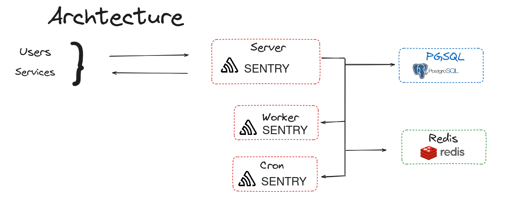

# Let's GO



---

## Generate secret key

```bash
docker-compose run --rm sentry-base config generate-secret-key
```

And then set generated key to **SENTRY_SECRET_KEY** in `.env`

## Initialize database

If this is a new database, you'll need to run upgrade.

```bash
docker-compose run --rm sentry-base upgrade
```

And create an initial user, if you need.

```bash
Would you like to create a user account now? [Y/n]: y
Email: admin@gmail.com 
Password: 
```

## Service Start

```bash
docker-compose up -d
```

And open **http://localhost:9000**
